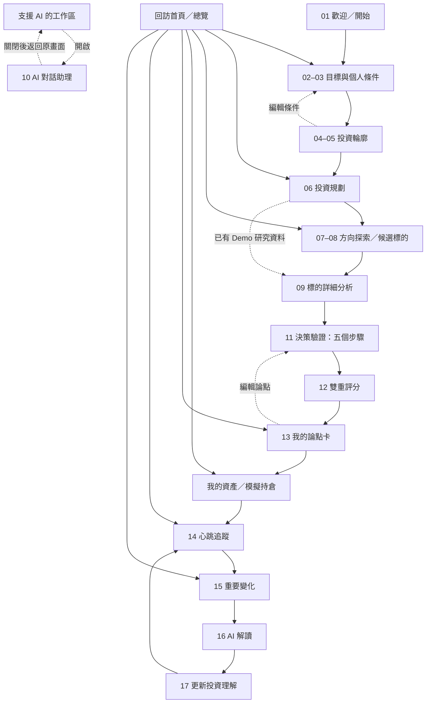

# 逆思投資 Version 1 使用者手冊

文件版本：1.2

適用版本：Version 1 前端競賽 Demo
更新日期：2026-08-19

## 1. 產品簡介

「逆思投資」是一套從個人目標出發的投資研究與決策整理工具。它協助使用者：

- 整理財務目標與個人條件。
- 分開理解風險承受意願、風險承受能力與所需風險。
- 查看個人化投資規劃草案。
- 探索投資方向與候選標的。
- 以模擬持倉比較目前資產配置與原始規劃。
- 透過證據、反方觀點及關鍵假設驗證投資理由。
- 建立論點卡並持續追蹤重要變化。

本產品用於研究與決策整理，不提供買進、賣出或持有指令，也不構成投資建議。

## 2. Version 1 Demo 範圍

Version 1 是可完整操作的 Electron／React 前端展示版，目前不需要後端、資料庫、Python Agent 或外部 LLM。

畫面資料分為兩類：

| 資料類型 | 目前狀態 |
|---|---|
| 台積電市場與財務資料 | 採用台積公司官方公開資料，畫面會標示來源與資料截止日，但不是即時行情 |
| 使用者目標、風險輪廓、配置比例與雙重評分 | 前端 Demo 情境，用於展示產品流程 |
| AI 對話回覆 | 前端預設 Demo 回覆，尚未連接外部 LLM |
| 模擬持倉 | 前端工作階段資料，可新增、編輯及移除；不會送出真實交易 |
| 操作結果保存 | 只保留在目前應用程式工作階段，尚未寫入資料庫 |

## 3. 啟動 Demo

### 3.1 Electron 桌面版

第一次使用時，在專案根目錄執行：

```bash
npm install
npm run dev
```

系統會開啟「逆思投資」桌面視窗。

### 3.2 瀏覽器版本

若只想使用網頁介面或檢查 RWD：

```bash
npm run dev:web
```

接著在瀏覽器開啟：

```text
http://127.0.0.1:5173/
```

停止程式時，回到執行指令的終端機並按 `Control + C`。

## 4. 畫面導覽

產品文件定義 17 個 Screen，目前前端保留原有需求追溯，並新增「我的資產」，合計 12 個可切換的工作區。部分工作區包含多個 Screen：

- 目標與個人條件工作區整合 Screen 02–03。
- 投資輪廓工作區整合 Screen 04–05。
- 投資探索工作區整合 Screen 07–08。
- 決策驗證工作區整合 Screen 11–12。
- 重要變化工作區整合 Screen 15–17。
- Screen 10「AI 對話助理」是全站共用的側邊面板，不是主流程必經頁面。

### 4.1 電腦版

左側選單提供五個主要入口：

- 首頁：查看目標、規劃、論點與重要變化摘要。
- 規劃：查看三層資金結構與規劃條件。
- 探索：瀏覽投資方向及候選標的。
- 資產：查看模擬持倉、配置比例與目標進度。
- 追蹤：查看可能影響判斷的重要變化。

其他操作：

- 點擊左上角「逆思投資」可回到產品介紹頁。
- 點擊右上角「投資輪廓」可直接查看目前輪廓。
- 點擊左下角「問問 AI」可開啟 AI 對話面板。

### 4.2 手機與窄螢幕版

- 使用畫面底部導覽列切換主要功能。
- 點擊左上角選單按鈕，可開啟完整側邊選單。
- 點擊選單外的遮罩區域可關閉選單。

## 5. 網站操作流程與頁面關係

網站由三種關係組成：第一次使用的主要旅程、回訪首頁提供的快捷入口，以及建立論點後持續運作的追蹤循環。主要旅程有建議順序，但使用者仍可透過側邊欄或手機底部導覽跳到主要工作區。

### 5.1 整體流程圖



### 5.2 第一次使用的主要旅程

| 階段 | 使用者要完成的事情 | 主要前往方式 |
|---|---|---|
| 歡迎／開始 | 理解產品定位，從個人目標而非商品開始 | 「開始建立我的目標」 |
| 目標與個人條件 | 完成六題問卷；最後一步才會儲存 | 「儲存並查看投資輪廓」 |
| 投資輪廓 | 分開理解風險意願、能力與所需風險 | 「查看我的投資規劃」 |
| 投資規劃 | 查看配置草案、限制條件與 AI 研究起點 | 「探索投資方向」或由已有資料的候選項目前往研究頁 |
| 投資探索 | 從研究方向切換到候選標的 | 「查看詳細分析」 |
| 標的分析 | 閱讀來源、證據、不同觀點與假設 | 「開始決策驗證」 |
| 決策驗證 | 依序完成五個步驟 | 「更新雙重評分」 |
| 雙重評分 | 分開查看標的成立度與個人適合度 | 「建立我的論點卡」 |
| 論點卡 | 保存可持續驗證的投資理由結構 | 「查看追蹤狀態」 |
| 我的資產 | 新增或編輯模擬持倉，並比較實際配置與原始規劃 | 主要導覽「資產」 |
| 心跳追蹤 | 追蹤標的、理由與個人條件的重要變化 | 「查看重要變化」 |
| 重要變化 | 依序了解事件、AI 解讀並選擇如何更新 | 「完成更新並持續追蹤」 |

### 5.3 回訪首頁與主要導覽

首頁是完成基本設定後的決策總覽，不是第一次使用流程中的必經步驟。直接開啟目前 Demo 網址時會先顯示首頁；點擊左上角「逆思投資」可回到產品介紹頁。

首頁可直接前往：

- 編輯目標與條件。
- 查看完整規劃。
- 繼續研究候選方向。
- 查看論點卡。
- 前往心跳追蹤。
- 查看目前的重要變化。

側邊欄與手機底部導覽則可直接切換首頁、規劃、探索、資產及追蹤。「我的論點」仍可從首頁與研究流程進入，但不占用手機版主要導覽位置。

### 5.4 跨頁資料關係與 Version 1 實際行為

產品預期的資料關係是：

```text
目標與個人條件
  → 投資輪廓
  → 投資規劃與研究限制
  → 候選方向與標的
  → 證據及決策驗證
  → 個人論點卡
  → 模擬持倉與配置對照
  → 重要變化追蹤與更新
```

Version 1 已完成頁面跳轉與互動關係，但部分資料承接仍為 Demo 模擬：

- 問卷儲存後會保留本次工作階段的答案，但尚未重新計算輪廓與規劃。
- 規劃頁的 AI 研究方向與候選類型目前來自固定 Mock Data。
- 決策驗證的輸入與選取內容尚未真正寫入論點卡。
- 模擬持倉可在本次工作階段新增、編輯或移除；重新整理後會回到預設情境。
- 模擬持倉的參考價格由使用者輸入，不是即時行情，也不會送出真實交易。
- 重要變化頁的更新選項尚未改寫規劃或論點；完成後統一返回心跳追蹤。
- 重新整理或重新啟動後，未寫入資料庫的操作狀態會回到 Demo 預設值。

## 6. 各功能操作說明

### 6.1 產品介紹

產品介紹頁說明逆思投資的四段旅程：建立輪廓、形成規劃、驗證決策及持續追蹤。

操作方式：

1. 點擊左上角「逆思投資」回到產品介紹。
2. 點擊「開始建立我的目標」。
3. 進入目標與個人條件編輯頁。

### 6.2 編輯目標與個人條件

問卷共有六個項目：

1. 我的目標
2. 目標期限
3. 投入能力
4. 投資經驗
5. 波動感受
6. 資金需求

目前已帶入 Demo 使用者答案。使用者可以：

- 點擊左側任一已完成題目直接查看或修改。
- 選擇答案後按「下一題」。
- 在最後一題按「儲存並查看投資輪廓」。
- 隨時按右上角「取消編輯」返回輪廓頁。

取消編輯不會覆蓋原有答案；只有完成最後一步並按下儲存按鈕，才會更新目前工作階段的答案。

> Version 1 限制：答案只保留在本次 App 工作階段，而且尚未連動正式輪廓計算引擎。因此修改答案後，輪廓分數與規劃內容仍會顯示既定 Demo 情境。

### 6.3 投資輪廓

本頁分開呈現三種風險概念：

- 風險承受意願：心理上願意承受多少波動。
- 風險承受能力：期限與資金條件實際能承受多少風險。
- 所需風險：達成目標可能需要承擔的風險程度。

請勿將三者視為同一個總分。

可使用的操作：

- 「編輯我的條件」：進入帶有目前答案的編輯模式。
- 「請 AI 解釋」：開啟目前輪廓情境的 AI 面板。
- 「查看我的投資規劃」：進入投資規劃頁。

### 6.4 我的投資規劃

本頁呈現規劃草案，包括：

- 核心配置：支撐長期目標的分散型配置。
- 成長配置：保留成長需求的研究型部位。
- 彈性資金：保留短期調整與生活資金彈性。
- 單一研究型部位上限。
- 單一產業觀察門檻。
- 需要重新檢視規劃的條件。
- AI 整理的研究方向與候選類型。

頁面依下列順序協助使用者閱讀：

1. 規劃摘要：說明目前條件為什麼具備規劃空間，不使用成功率或報酬預測進度條。
2. 資金分配：核心配置、成長配置與彈性資金合計 100%。
3. 配置限制：單一研究型標的上限 10%，單一產業達 40% 時提醒檢查集中風險。
4. 重新檢視條件：目標、期限、投入能力、資金需求或波動承受條件改變時重新規劃。

10% 與 40% 都以「總投資資產」為計算基準，是套用在配置上的限制，不會與核心 60%、成長 25%、彈性 15% 相加。畫面會以每投入 NT$ 100,000 換算金額，協助理解各比例的實際意義。

畫面中的配置比例、限制門檻與可行性狀態屬於 Demo 規劃情境，不是報酬預測或達成保證。

「AI 研究起點」可切換兩種內容：

- 產業與主題方向：查看方向在配置中的角色、研究理由及應先驗證的風險。
- 候選標的與類型：查看已有 Demo 研究資料或仍待進一步篩選的項目。

操作方式：

- 點擊「探索投資方向」依主要流程前往探索頁。
- 台積電已有 Demo 研究資料，可從候選項目直接前往標的詳細分析。
- 尚未建立具名候選標的的項目，會先前往探索頁繼續篩選。

> Version 1 限制：AI 研究起點是固定 Mock AI 情境，尚未根據使用者剛修改的答案即時計算，也不是即時投資推薦。

### 6.5 投資方向與候選標的

本頁包含兩個頁籤：

- 投資方向：了解核心配置與成長配置的研究方向。
- 候選標的：查看目前值得進一步研究的標的。

操作方式：

1. 在「投資方向」查看方向與個人目標的關聯。
2. 點擊「查看候選標的」，或直接切換到「候選標的」頁籤。
3. 查看台積電（2330）的研究條件符合度與個人初步適合度。
4. 點擊「查看詳細分析」。

候選標的代表值得繼續研究，不代表系統要求購買。

### 6.6 我的資產與模擬持倉

本頁把使用者目前記錄的持倉與原始投資規劃放在一起，呈現：

- 總資產、持倉市值、投入成本與未實現損益。
- 目前資產相對財務目標的完成進度。
- 長期投資、成長投資與保留資金的實際比例。
- 實際配置與原始規劃比例的比較。
- 超過單一部位規劃上限時的集中風險提醒。

操作方式：

1. 從側邊欄或手機底部導覽點擊「資產」。
2. 點擊「新增模擬持倉」，選擇標的、配置用途並輸入數量、平均成本與參考價格。
3. 點擊持倉右側「編輯」可修改資料；點擊垃圾桶按鈕並確認後，可移除單一標的。
4. 勾選多筆持倉，或使用清單上方的全選核取方塊，再點擊垃圾桶按鈕，即可一次移除多筆持倉。

模擬持倉只用於檢查配置與研究流程，不會連結券商或執行買賣。參考價格由使用者輸入，因此畫面金額是估算值，不是即時帳戶資產。

### 6.7 台積電詳細分析

本頁使用台積公司 2026 年第二季官方公開資料，呈現：

- 第二季合併營收與年增率。
- 毛利率。
- 稀釋每股盈餘（EPS）。
- 7 奈米及更先進製程的營收占比。
- 支持證據。
- 不同觀點。
- 關鍵假設。

操作方式：

- 點擊資料來源連結，可在外部瀏覽器查看台積公司官方資料。
- 點擊各分析區塊標題，可展開或收合內容。
- 點擊「詢問 AI」，可從目前標的情境開啟 AI 面板。
- 點擊「開始決策驗證」進入五步驟流程。

資料具有明確截止日，不代表目前即時行情。

### 6.8 五步驟決策驗證

決策驗證必須依序完成，完成目前步驟後才會解鎖下一步。

#### Step 1：投資理由

用自己的話說明為什麼關注這個標的，至少輸入 20 個字。

#### Step 2：支持證據

從台積公司官方公開資料中至少選擇一項與投資理由相關的證據。

#### Step 3：不同觀點

至少選擇一項反方觀點，避免只保留支持原本立場的資訊。

#### Step 4：關鍵假設

至少選擇一項投資理由成立所依賴的條件。

#### Step 5：重要觀察

輸入具體的重新檢視條件，至少 8 個字。也可以使用畫面提供的毛利率或先進製程占比範例。

完成規則：

- 已完成步驟會顯示勾選符號，並可返回修改。
- 修改內容後，需要重新按「更新雙重評分」。
- 五個步驟都完成後才會顯示評分。
- 評分完成後才能建立論點卡。

### 6.9 雙重評分

系統將兩個問題分開呈現：

- 標的成立度：標的本身是否具備值得持續研究的條件。
- 個人適合度：標的與個人目標、輪廓及規劃之間的關聯。

兩個分數不可合併成單一推薦分數。Version 1 的分數是前端 Demo 評估，不是台積公司的官方資料，也不是投資建議。

### 6.10 我的論點卡

論點卡整理以下內容：

- 投資理由。
- 支持證據。
- 不同觀點。
- 關鍵假設。
- 重要觀察條件。
- 標的成立度與個人適合度。

可點擊「編輯論點」返回決策驗證，或點擊「查看追蹤狀態」進入心跳追蹤。

> Version 1 限制：決策驗證中輸入的內容尚未寫入資料庫，論點卡目前會顯示既定 Demo 論點資料。

### 6.11 心跳追蹤

心跳追蹤同時關注三種脈絡：

- 標的資訊：營收、財報、估值、基本面與重要事件。
- 投資理由：支持證據、反方觀點與關鍵假設。
- 個人條件：目標、期限、投入能力、輪廓與部位。

Version 1 目前顯示一項台積電官方展望事件：第三季毛利率展望低於第二季實際值。這是一項需要理解的變化，不代表原始投資理由已經失效。

點擊「查看重要變化」進入後續分析。

### 6.12 重要變化與更新理解

此工作區分成三個步驟，可直接點擊上方頁籤切換：

1. 發生什麼：查看實際數據、受影響假設及與目標的關聯。
2. AI 解讀：查看基於官方資料形成的 Demo 結構化解讀。
3. 更新理解：選擇接下來如何處理這項變化。

可選擇：

- 保持目前判斷。
- 更新投資理由。
- 更新觀察條件。
- 調整投資規劃。

完成後點擊「完成更新並持續追蹤」。Version 1 會返回心跳追蹤頁，但尚未永久保存選擇。

> Version 1 限制：目前即使選擇「調整投資規劃」，完成後仍會返回心跳追蹤，不會自動跳到規劃頁或修改配置內容。

### 6.13 AI 對話助理

AI 面板可從側邊欄或各支援 AI 的畫面開啟，並顯示目前所在情境。

操作方式：

1. 點擊「問問 AI」、「詢問 AI」或其他 AI 按鈕。
2. 點擊建議問題，或在輸入框輸入內容。
3. 按 `Enter` 或點擊送出按鈕。
4. 點擊右上角 `×`、面板外遮罩，或按 `Esc` 關閉。

Version 1 使用前端 Demo 回覆，不會呼叫 OpenAI API、Python Agent 或其他外部 LLM。輸入任意問題時，回答內容仍以目前畫面預設情境為主。

## 7. Demo 展示建議

若用於競賽簡報，建議依下列順序操作：

1. 從產品介紹說明「不是從商品開始，而是從個人目標開始」。
2. 展示問卷已帶入答案、可以編輯也可以取消。
3. 說明三種風險必須分開理解。
4. 從規劃進入投資探索，查看台積電候選標的。
5. 在標的分析頁指出官方資料來源與資料截止日。
6. 完成五步驟決策驗證，強調反方觀點與關鍵假設。
7. 說明標的成立度與個人適合度不合併。
8. 進入心跳追蹤，展示重要變化如何連回原始假設與個人目標。

## 8. 常見問題

### 點錯「編輯我的條件」後，一定要重新設定嗎？

不用。頁面會帶入目前答案，直接點擊「取消編輯」即可返回，原有答案不會被修改。

### 為什麼修改問卷後，投資輪廓沒有重新計算？

Version 1 尚未串接正式輪廓計算引擎，目前只示範編輯與保存流程。Version 2 才會根據答案重新計算輪廓與規劃。

### 為什麼重新啟動後會回到預設內容？

Version 1 沒有連接資料庫。使用者答案與操作狀態只保留在目前工作階段。

### 畫面中的台積電資料是即時資料嗎？

不是。資料來自台積公司官方公開資訊，畫面會標示截止日與來源；目前不會自動更新即時股價或最新財報。

### 研究條件符合度、個人適合度與雙重評分是真實模型結果嗎？

不是。這些分數目前用於展示產品互動，屬於前端 Demo 評估。

### AI 為什麼無法自由回答所有問題？

Version 1 尚未連接外部 LLM，因此使用可重現的前端 Demo 回覆。Version 2 才會串接後端與 LLM Agent。

### 這個產品會建議我買進或賣出嗎？

不會。逆思投資協助整理研究資訊、投資理由、反方觀點與重要變化，不提供買賣指令。

## 9. Version 1 已知限制

- 尚未提供使用者帳號與登入。
- 尚未連接資料庫或跨裝置同步。
- 問卷答案尚未驅動正式輪廓與規劃計算。
- 規劃頁的 AI 研究方向與候選類型目前是固定 Mock Data。
- 決策驗證內容尚未同步到論點卡。
- 更新理解的選擇尚未永久保存，也尚未依選項導向對應編輯流程。
- 市場資料不會自動更新。
- AI 為前端 Demo 回覆，尚未連接 LLM Agent。
- 目前不提供正式 Electron 安裝包與程式簽章。

## 10. 資料與責任說明

本專案為競賽 Demo。台積電財務內容採用具有截止日的官方公開資料；個人情境、配置比例、符合度與評分則用於展示前端流程。所有內容僅供研究與產品展示，不構成投資建議、報酬保證或買賣指令。
